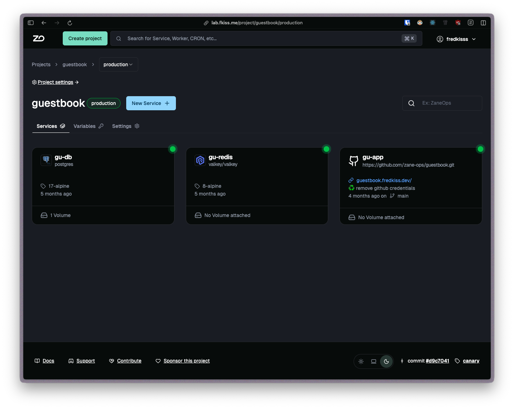

# Docker thumbnails-api

API used for providing the icons for docker images in ZaneOps:

<p align="center">
<picture>
    <source media="(prefers-color-scheme: dark)" srcset="./images/project-detail-dark.png">
    <source media="(prefers-color-scheme: light)" srcset="./images/project-detail-light.png">
    
</picture>
</p>

To start:

```shell
# start the database with docker-compose
docker-compose up -d  

# Copy the env file
cp .env.example .env

# install the packages
bun install

# run the app
bun run dev
```

This project was created using `bun init` in bun v1.2.21. [Bun](https://bun.com) is a fast all-in-one JavaScript runtime.
